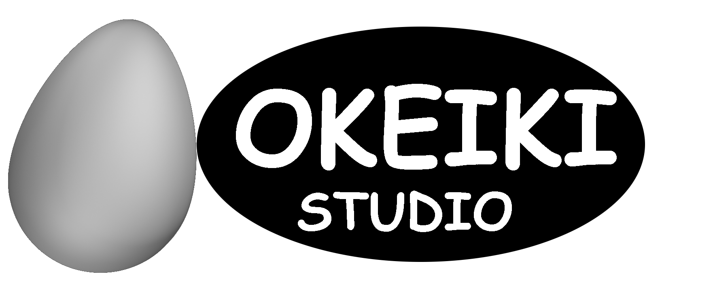
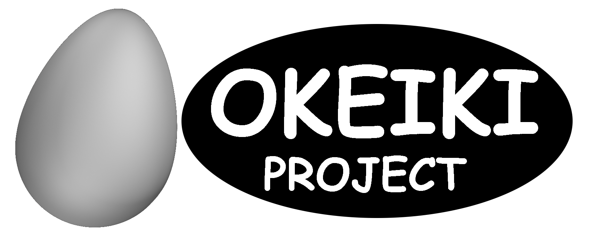

<meta charset="UTF-8">
<h1 align="center" style="font-size: 48px">🥚 Okeiki Project</h1>

    

  ## 🤨 Что это?

    

Это репозиторий команды Okeiki Studio.
Нам можно доверить разработку приложений и игр.

  ## 🤝 Авторы:

<table align="center">
  <tr>
    <td align="center">
       
      <b>notforyou!</b> 
      <a href="https://github.com/notforyou-dev">@notforyou-dev</a>
    </td>
    <td align="center">
       
      <b>Ruski bober</b> 
      <a href="https://github.com/polskibober">@polskibober</a>
    </td>
  </tr>
</table>
